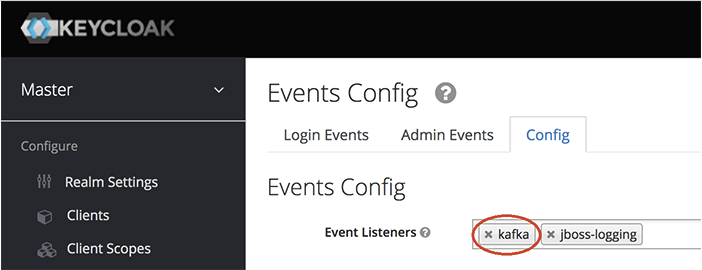

[](http://www.apache.org/licenses/LICENSE-2.0)

# Keycloak Events SPI

A [Service Provider](https://www.keycloak.org/docs/latest/server_development/index.html#_providers) That will push
admin events to a specified Kafka topic for consumption.

provider(s) are defined:

* KafkaEventListenerProvider to record the Keycloak events and push to Kafka topic

## License

 See [LICENSE file](./LICENSE)

## Environment variables Keycloak deployment will need for Kafka Events SPI

| Environment Variables     |         Description          | Required | Default                 |
|:--------------------------|:----------------------------:|:--------:|:------------------------|
| `KAFKA_BOOTSTRAP_HOST` |  The Kafka server location   |    ✅     | `kafka:9092`            |
| `KAFKA_CLIENT_ID`         |       Kafka client ID        |    ✅     | `keycloak`              |
| `KAFKA_ADMIN_TOPIC`       | Kafka topic for Admin events |    ✅     | `keycloak-admin-events` |
| `KAFKA_TOPIC`             |      Kafka topic events      |    ✅     | `keycloak-events`       |
| `KAFKA_SECURITY_PROTOCOL` | Security protocol (PLAINTEXT, SSL, SASL_PLAINTEXT, SASL_SSL) | ❌ | `PLAINTEXT` |
| `KAFKA_SASL_MECHANISM` | SASL mechanism (PLAIN, SCRAM-SHA-256, SCRAM-SHA-512, GSSAPI, OAUTHBEARER) | ❌ | - |
| `KAFKA_SASL_USERNAME` | SASL username for authentication | ❌ | - |
| `KAFKA_SASL_PASSWORD` | SASL password for authentication | ❌ | - |
| `KAFKA_SSL_CA_CERTIFICATE` | CA certificate in PEM format for TLS | ❌ | - |
| `KAFKA_SSL_ENDPOINT_IDENTIFICATION_ALGORITHM` | Endpoint identification algorithm (empty to disable hostname verification) | ❌ | - |

## Build

Build the project using:
 * [Maven](https://maven.apache.org/)

The project is packaged as a jar file and bundles the prometheus client libraries.

### Maven

To build the jar file using maven run the following command (will bundle the prometheus client libraries as well):

```sh
  mvn package
```

Run tests

```sh
  mvn test
```

It will build the project and write jar to the _./target_.

### Configurable versions for some packages

You can build the project using a different version of Keycloak or kafka, running the command:

#### For Maven

```sh
mvn clean package -Dkeycloak.version=15.0.0 -Dkafka.version=3.7.0
```

## Install and setup

### On Keycloak Quarkus Distribution

> We assume the home of keycloak is on the default `/opt/keycloak`

You will need to either copy the `jar` into the build step and run step, or copy it from the build stage. Following the [example docker instructions](https://www.keycloak.org/server/containers)
No need to add `.dodeploy`.

```
# On build stage
COPY keycloak-events-spi.jar /opt/keycloak/providers/

# On run stage
COPY keycloak-events-spi.jar /opt/keycloak/providers/

```
If not copied to both stages keycloak will complain
```
ERROR: Failed to open /opt/keycloak/lib/../providers/keycloak-events-spi.jar
```

### Enable Events in keycloak
 1. Open administration console
 2. Choose realm
 3. Go to Events
 4. Open `Config` tab and add `kafka` to Event Listeners.



## Podman/Docker Container
The simplest way to enable the kafka module in a docker container is to create a custom docker image from the keycloak
base image. A simple example can be found in the [Dockerfile](Dockerfile).
When you build this image on your local machine by using
```sh
podman build . -t keycloak-kafka --tls-verify=false
```

You can test everything by running the [docker-compose](docker-compose.yml) file on your local machine.
Note: Make sure you have set up Podman to work with [compose](https://podman-desktop.io/docs/compose/setting-up-compose).
```sh
podman compose --file docker-compose.yml up --detach
```


## Strimzi Security Configuration

For connecting to a Strimzi-managed Kafka cluster with SCRAM-SHA-512 authentication and TLS certificates:

```bash
# SASL/SSL Configuration
export KAFKA_SECURITY_PROTOCOL=SASL_SSL
export KAFKA_SASL_MECHANISM=SCRAM-SHA-512
export KAFKA_SASL_SCRAM_USERNAME=keycloak-service
export KAFKA_SASL_SCRAM_PASSWORD=your-secure-password

# TLS Certificate Configuration
export KAFKA_SSL_PEM_CA_CERTIFICATES="-----BEGIN CERTIFICATE-----
...
-----END CERTIFICATE-----"
```

**Additional Security Variables:**
- `KAFKA_SASL_USERNAME` / `KAFKA_SASL_PASSWORD` - For PLAIN mechanism
- `KAFKA_SSL_PEM_PRIVATE_KEY` / `KAFKA_SSL_PEM_CERTIFICATE_CHAIN` - For client authentication
- `KAFKA_SSL_ENABLED_PROTOCOLS` - TLS protocols (e.g., TLSv1.2,TLSv1.3)
